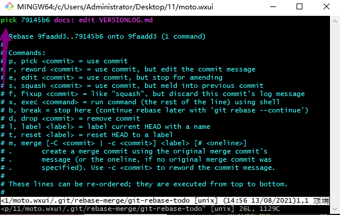
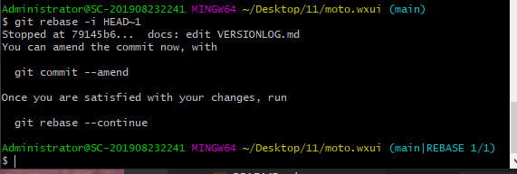
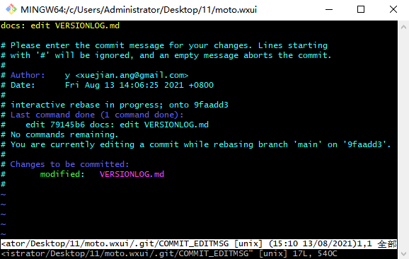
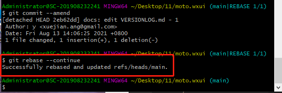

# 修改远程提交记录

## 命令

命令 | 说明
---  | ---
git rebase -i HEAD~1 | 获取 commit log记录
git commit --amend   | 编辑 commit 信息
git rebase --continue| 保存 编辑后的commit 信息
git push --force origin main | 强推到仓库
git rebase --abort   | 退出 rebase模式

**编辑模式注意点**
- 任何操作前都必须要按 `insert`(插入键)
- 编辑完信息后需要按 `Esc`(退出键)来退出 `insert`模式
- 然后输入 `:wq`(退出命令) **+** 按 `Enter`(确认命令) 退出编辑模式

## 详细步骤
1、`git rebase -i HEAD~1` 
> 获取最新1条commit log 记录，~2也就是最新的2条数据，依此类推 

 

2、输入命令后、进入编辑页面，此时要按 `insert` 插入键，这时才可以对编辑页面进行操作

可以操作后，将箭头所指之处`pick`修改为`edit`，然后按下`Esc`键退出操作；

退出操作后，将输入法切换到英文模式，依次按下 `:wq` + `Enter`，退出编辑页面

 

3、退出编辑页面后、会得到下面两行命令行、依次输入执行

 

4、`git commit --amend`
> 编辑提交信息和提交人名称、邮箱

要按 `insert` 后才可以编辑commit 信息、然后按下`Esc`键退出操作、按`:wq` + `Enter`，退出编辑页面

 

5、`git rebase --continue`
> 保存编辑后的信息

出现红框内的信息后、就是修改成功了、push强推到仓库就可以了

 

6、`git push --force origin main`
> 必须要强推到仓库、才可以修改